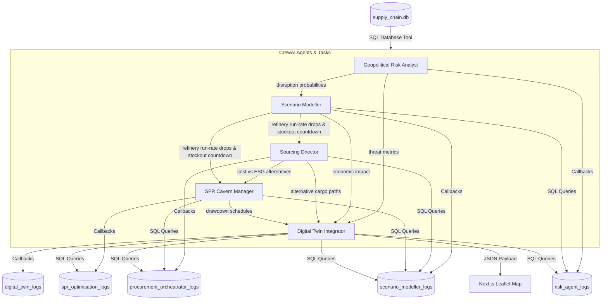

# 🛡️ INDRA: Energy Supply Chain Resilience Platform
> **INDRA** (*Intel-driven Network for Disruption Resilience & Analysis*) is a Multi-Agent AI and Geospatial Digital Twin platform designed to safeguard national energy security by orchestrating autonomous intelligence analysis, macroeconomic impact modeling, adaptive procurement, and strategic petroleum reserve releases during maritime chokepoint disruptions.

---

## 📌 The Problem
India imports over **85% of its crude oil requirements**, leaving the national economy highly vulnerable to geopolitical shocks, port strikes, and maritime conflicts.
1. **Critical Bottlenecks (SPOFs)**: Key choke points (such as the **Strait of Hormuz** or the **Red Sea**) carry the bulk of India's crude imports. A partial or complete closure of these corridors instantly blocks tankers.
2. **Siloed Intelligence**: Geopolitical intelligence, downstream refinery operations, global spot chartering, and strategic reserve policies are managed in isolation. When a crisis hits, response coordination takes days.
3. **Complex Trade-offs**: Rerouting oil shipments (e.g., around the Cape of Good Hope) bypasses threat zones but increases transit times by 20+ days, spiking carbon footprints and spot prices.

---

## ⚡ The Solution
INDRA handles this challenge by combining a **Chained ReAct Multi-Agent System** with a **Geospatial Digital Twin** that simulates, optimizes, and visualizes resilience strategies in real time.



### 1. Database-Driven Agent Communication
Rather than bloating LLM context windows or passing volatile variables, INDRA uses **Database State Communication**:
* Every simulation run gets a unique `run_id` (e.g. `run_20260623_103215_a4b9c1`).
* As each agent finishes its reasoning task, its raw text and parsed JSON outputs are logged directly to dedicated SQLite tables (`risk_agent_logs`, `scenario_modeller_logs`, etc.).
* Downstream agents read their dependencies' state using database queries. This keeps the execution completely **auditable**, **modular**, and **resilient**.

### 2. Multi-Agent Personas
1. **Geopolitical Risk Intelligence Analyst**: Evaluates news logs and local policy briefs to calculate disruption probabilities for shipping lanes and suppliers.
2. **Disruption Scenario Modeller (Downstream Economist)**: Computes refinery run-rate cuts, days-to-stockout countdowns, power grid blackout risks, and macroeconomic GDP drag.
3. **Adaptive Procurement Orchestrator**: Ranks alternative import options, comparing Cost-Optimized profiles with ESG-Optimized carbon surcharges.
4. **Strategic Reserve (SPR) Optimisation Agent**: Schedules emergency cavern drawdowns (Padur, Mangaluru, Visakhapatnam) to bridge the transit gap, and designs backwardation-hedged refilling schedules.
5. **Geospatial Digital Twin Agent**: Compiles all outputs into unified map layer geometries (vessels, routes, alert zones) for frontend rendering.

---

## 🛠️ Tech Stack & Architecture

| Component | Technology | Role |
| :--- | :--- | :--- |
| **Frontend UI** | Next.js 16 (React 19, TypeScript), TailwindCSS | High-performance, dark-theme geospatial operations dashboard |
| **Geospatial Map** | React-Leaflet, Leaflet | Live AIS vessel mapping, threat boundary zones, and route polylines |
| **Data Graphs** | Recharts, SVG Bezier Flows | Interactive supply-chain knowledge graph and telemetry charts |
| **Backend API**| FastAPI, Uvicorn | High-throughput REST API serving telemetry and triggering simulations |
| **Agent Engine** | CrewAI, LangChain, SQLite Logs | Sequential reasoning agent chains using Database State Communication |
| **Embeddings & LLM**| Gemini API (`text-embedding-004`), NVIDIA NIM | High-fidelity LLM inference and document embedding generation |
| **Databases** | SQLite (`supply_chain.db`), LanceDB | System telemetry database & semantic vector database (RAG) |

---

## 🌟 Advanced Capabilities & Hardening

### 1. Custom Geopolitical Intel Injector (RAG Input)
* In the **Control Center**, users can input custom news headlines or intelligence briefings (e.g. *"Drone strikes disrupt loading terminals at Basrah Port"*).
* The **Geopolitical Risk Agent** dynamically parses this custom input, mapping it to routes and refineries, overriding database defaults, and triggering a customized multi-agent simulation chain.

### 2. Interactive Topological Knowledge Graph
* Visualizes the complete 5-column supply chain topology: `Suppliers` ➔ `Transit Corridors` ➔ `Active Shipments` ➔ `Refineries` ➔ `Strategic Reserves (SPR)`.
* **State Propagation**: Propagates color codes based on real-time simulation states (e.g., Strait of Hormuz blocked ➔ Middle East tankers blocked ➔ refineries stressed ➔ SPR caverns drawn down).
* **Hover Highlights**: Interactively highlights selected supply flow paths using SVG cubic Bezier curve illumination.

### 3. Intel Briefings & Vector Store (RAG Library)
* A dedicated **Intel Briefings** section allows operators to upload intelligence documents, warning memos, or policy PDFs (`.pdf`, `.txt`, `.md`).
* **Document Ingestion**: Splits documents into overlapping text chunks and computes vector embeddings. Uses Gemini API (`text-embedding-004`) when online, falls back to NVIDIA NIM embeddings, and runs a character-hash local fallback if offline.
* **Vector Search Playground**: Provides a direct Semantic Search interface showing match percentage meters and matching text excerpts using cosine similarity.
* **Agentic Tool Integration**: Exposes the `Search Briefings Library` tool to the Geopolitical Risk Agent, allowing it to autonomously cross-reference policy guidelines or historical precedents during simulations.

### 4. Production Exception Protections & Hardening
* **Coordinate Validation Safeguards**: All Leaflet map overlays (refineries, suppliers, SPR caverns, active shipments, and alert zones) are wrapped in strict coordinate validation handlers. Coordinates are cast using `Number()` and validated with `isNaN()` to filter out incomplete items, completely preventing client-side leaflet crashes on undefined maps.
* **KPI Formatting Safeties**: Implemented `safeFixed` and `safeLocale` formatting helpers inside data views to prevent React hydration and rendering crashes when SQL queries return null, undefined, or string-encoded numbers.
* **Refinery & SPR Fallbacks**: Outfitted popups and charts with fallback data mappings to gracefully handle partial simulation outputs without breaking user flows.

---

## 🚀 Steps to Run the Project

### 1. Prerequisites
* **Python**: Version `3.10`, `3.11`, or `3.12`.
* **Node.js**: Version `18` or higher.

---

### 2. Backend & Agent Setup
1. **Navigate to the Project Root**:
   ```bash
   cd "ET AI Hackathon"
   ```
2. **Create and Activate a Virtual Environment**:
   ```bash
   # Windows
   python -m venv .venv
   .venv\Scripts\activate

   # macOS/Linux
   python3 -m venv .venv
   source .venv/bin/activate
   ```
3. **Install Python Dependencies**:
   ```bash
   pip install -r requirements.txt
   ```
4. **Seed the SQLite Database** (Optional - database comes pre-seeded):
   ```bash
   python data/data_generator.py
   ```
5. **Start the FastAPI Application Server**:
   ```bash
   python -m uvicorn backend.main:app --host 127.0.0.1 --port 8000
   ```
   *The backend documentation will be live at `http://127.0.0.1:8000/docs`.*

---

### 3. Frontend Dashboard Setup
1. **Open a new terminal window** and navigate to the frontend directory:
   ```bash
   cd frontend
   ```
2. **Install Node Packages**:
   ```bash
   npm install
   ```
3. **Run the Development Server**:
   ```bash
   npm run dev
   ```
   *Or build the optimized production files for faster local execution:*
   ```bash
   npm run build
   npm start
   ```
4. **View the Dashboard**:
   Open your browser and navigate to **`http://localhost:3000`**.

---

## 🐳 Docker Deployment & Containerization

INDRA is fully containerized using Docker and Docker Compose. This packages the Next.js frontend, FastAPI backend, a Redpanda (Kafka) message broker, and a PostGIS PostgreSQL database into a single cohesive network.

### 1. Run the Platform via Docker Compose
To build and launch all services simultaneously:

1. **Provide API Credentials**: Ensure your root `.env` file contains your credentials:
   ```env
   GEMINI_API_KEY=your_gemini_api_key
   NVIDIA_API_KEY=your_nvidia_api_key
   or any API key you have
   ```
2. **Launch Services**: Run the following command in the project root:
   ```bash
   docker compose up --build
   ```
   * To run in the background (detached mode), add the `-d` flag:
     ```bash
     docker compose up -d
     ```
3. **Verify running containers**:
   * **Frontend Dashboard**: Open your browser to `http://localhost:3000`
   * **FastAPI Backend Server**: Live at `http://localhost:8000/docs`
   * **Kafka Broker (Redpanda Console)**: Available on `http://localhost:19092`

---

### 2. How to Rebuild and Push Changes to Docker Hub

If you make modifications to the codebase (agents, API, or React panels) and want to push the updated images:

1. **Rebuild local Docker images**:
   ```bash
   docker compose build
   ```
   *This command parses the Dockerfiles, recompiles Next.js, and bundles Python libraries.*

2. **Authenticate with Docker Hub**:
   ```bash
   docker login
   ```
   *Log in with your Docker ID (e.g., `abhay120`) and password/token.*

3. **Push the updated images**:
   ```bash
   docker push abhay120/indra-backend:latest
   docker push abhay120/indra-frontend:latest
   ```

---

## 🔍 How to Demo INDRA

1. **Dashboard Control Center**:
   * View the live shipments and status of the Middle East corridors on the interactive map.
   * Trigger a **Strait of Hormuz Closure** or a **Red Sea Crisis** simulation using the launcher buttons.
2. **Review Agent Workflows**:
   * Click through the side tabs (**Asset Directory**, **Risk Analyst**, **Scenario Modeller**, **Sourcing & Logistics**, and **Strategic Reserves**) to inspect high-fidelity Recharts graphs, refinery depletion countdowns, alternative route rankings, and cavern drawdown timelines.
3. **Audit the Multi-Agent Logs**:
   * Go to **Audit Archives** in the sidebar. Select your run ID from the timeline panel.
   * Inspect the exact SQL queries executed by that agent and review the raw JSON response payload returned by the LLM.
