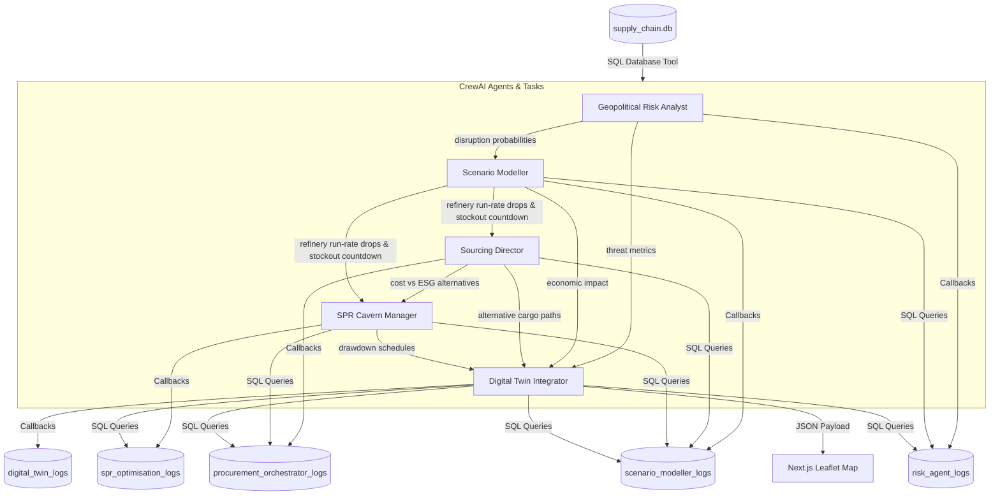

# INDRA: Energy Supply Chain Resilience Platform

> **INDRA** (*Intel-driven Network for Disruption Resilience & Analysis*) is a Multi-Agent AI and Geospatial Digital Twin prototype designed to safeguard national energy security by orchestrating autonomous intelligence analysis, macroeconomic impact modeling, adaptive procurement, and strategic petroleum reserve releases during maritime chokepoint disruptions.

---

## 📌 The Problem

India imports over **85% of its crude oil requirements**, leaving the national economy highly vulnerable to geopolitical shocks, port strikes, and maritime conflicts. 
1. **Critical Bottlenecks (SPOFs)**: Key choke points (such as the **Strait of Hormuz** or the **Red Sea**) carry the bulk of India's crude imports. A partial or complete closure of these corridors instantly blocks tankers.
2. **Siloed Intelligence**: Geopolitical intelligence, downstream refinery operations, global spot chartering, and strategic reserve policies are managed in isolation. When a crisis hits, response coordination takes days.
3. **Complex Trade-offs**: Rerouting oil shipments (e.g., around the Cape of Good Hope) bypasses threat zones but increases transit times by 20+ days, spiking carbon footprints and spot prices.

---

## ⚡ The Solution

INDRA handles this challenge by combining a **Chained ReAct Multi-Agent System** with a **Geospatial Digital Twin** that simulates, optimizes, and visualizes resilience strategies in real time.



### 1. Database-Driven Agent Communication
Rather than bloating LLM context windows or passing volatile variables, INDRA uses **Database State Communication**:
* Every simulation run gets a unique `run_id` (e.g. `run_20260623_103215_a4b9c1`).
* As each agent finishes its reasoning task, its raw text and parsed JSON outputs are logged directly to dedicated SQLite tables (`risk_agent_logs`, `scenario_modeller_logs`, etc.).
* Downstream agents read their dependencies' state using database queries. This keeps the execution completely **auditable**, **modular**, and **resilient**.

### 2. Multi-Agent Personas
1. **Geopolitical Risk Intelligence Analyst**: Evaluates news logs to calculate disruption probabilities for shipping lanes and suppliers.
2. **Disruption Scenario Modeller (Downstream Economist)**: Computes refinery run-rate cuts, days-to-stockout countdowns, power grid blackout risks, and macroeconomic GDP drag.
3. **Adaptive Procurement Orchestrator**: Ranks alternative import options, comparing Cost-Optimized profiles with ESG-Optimized carbon surcharges.
4. **Strategic Reserve (SPR) Optimisation Agent**: schedules emergency cavern drawdowns (Padur, Mangaluru, Visakhapatnam) to bridge the transit gap, and designs backwardation-hedged refilling schedules.
5. **Geospatial Digital Twin Agent**: Compiles all outputs into unified map layer geometries (vessels, routes, alert zones) for frontend rendering.

---

## 📂 Project Structure

```text
├── agents/                       # CrewAI Agent definitions and tools
│   ├── config.py                 # SQLite db tools & task logging callbacks
│   ├── risk_agent.py             # Geopolitical Risk Analyst Agent
│   ├── scenario_modeller_agent.py# Disruption Scenario Modeller Agent
│   ├── procurement_orchestrator_agent.py # Adaptive Procurement Agent
│   ├── spr_optimisation_agent.py # Strategic Reserves (SPR) Agent
│   └── digital_twin_agent.py     # Geospatial Twin Compiler Agent
├── backend/                      # FastAPI Backend Server
│   └── main.py                   # REST endpoints, CORS & Crew launcher
├── data/                         # Data layer
│   ├── data_generator.py         # Seed script generating 10m baseline data
│   └── supply_chain.db           # SQLite database
├── frontend/                     # Next.js 14 Web Application
│   ├── src/app/                  # App Router Pages
│   │   ├── page.tsx              # Control Center (Map + Tickers)
│   │   ├── infrastructure/       # Refining, SPR, & Supplier Directory
│   │   ├── risk/                 # Geopolitical Threat charts
│   │   ├── scenario/             # Run-rate & downstream impact charts
│   │   ├── procurement/          # Sourcing & Logistics rankings
│   │   ├── spr/                  # Cavern depletion & release schedules
│   │   └── runs/                 # Simulation log database inspector
│   └── src/components/           # Reusable UI (Sidebar, Header, Leaflet Map)
├── tests/
│   └── run_crew.py               # CLI Multi-Agent sequential test runner
├── requirements.txt              # Backend python packages
└── .gitignore                    # Git exclude configuration
```

---

## 🚀 Steps to Run the Project

### 1. Prerequisites
* **Python**: Version `3.10`, `3.11`, or `3.12`.
* **Node.js**: Version `18` or higher.
* **Ollama**: (Optional) For running fallback models locally (e.g. `qwen2.5:7b`).

---

### 2. Backend & Agent Setup
1. **Navigate to the Project Root**:
   ```bash
   cd "ET AI Hackathon"
   ```
2. **Create and Activate a Virtual Environment**:
   ```bash
   # Windows
   python -m venv .venv
   .venv\Scripts\activate

   # macOS/Linux
   python3 -m venv .venv
   source .venv/bin/activate
   ```
3. **Install Python Dependencies**:
   ```bash
   pip install -r requirements.txt
   ```
4. **Seed the SQLite Database** (Optional - database comes pre-seeded):
   ```bash
   python data/data_generator.py
   ```
5. **Start the FastAPI Application Server**:
   ```bash
   python -m uvicorn backend.main:app --host 127.0.0.1 --port 8000
   ```
   *The backend documentation will be live at `http://127.0.0.1:8000/docs`.*

---

### 3. Frontend Dashboard Setup
1. **Open a new terminal window** and navigate to the frontend directory:
   ```bash
   cd frontend
   ```
2. **Install Node Packages**:
   ```bash
   npm install
   ```
3. **Run the Development Server**:
   ```bash
   npm run dev
   ```
   *Or build the optimized production files for faster local execution:*
   ```bash
   npm run build
   ```
   ```bash
   npm start
   ```
4. **View the Dashboard**:
   Open your browser and navigate to **`http://localhost:3000`**.

---

## 🔍 How to Demo INDRA

1. **Dashboard Control Center**:
   * View the live shipments and status of the Middle East corridors on the interactive map.
   * Trigger a **Strait of Hormuz Closure** or a **Red Sea Crisis** simulation using the launcher buttons.
2. **Review Agent Workflows**:
   * Click through the side tabs (**Asset Directory**, **Risk Analyst**, **Scenario Modeller**, **Sourcing & Logistics**, and **Strategic Reserves**) to inspect high-fidelity Recharts graphs, refinery depletion countdowns, alternative route rankings, and cavern drawdown timelines.
3. **Audit the Multi-Agent Logs**:
   * Go to **Audit Archives** in the sidebar. Select your run ID from the timeline panel.
   * Inspect the exact SQL queries executed by that agent and review the raw JSON response payload returned by the LLM.
